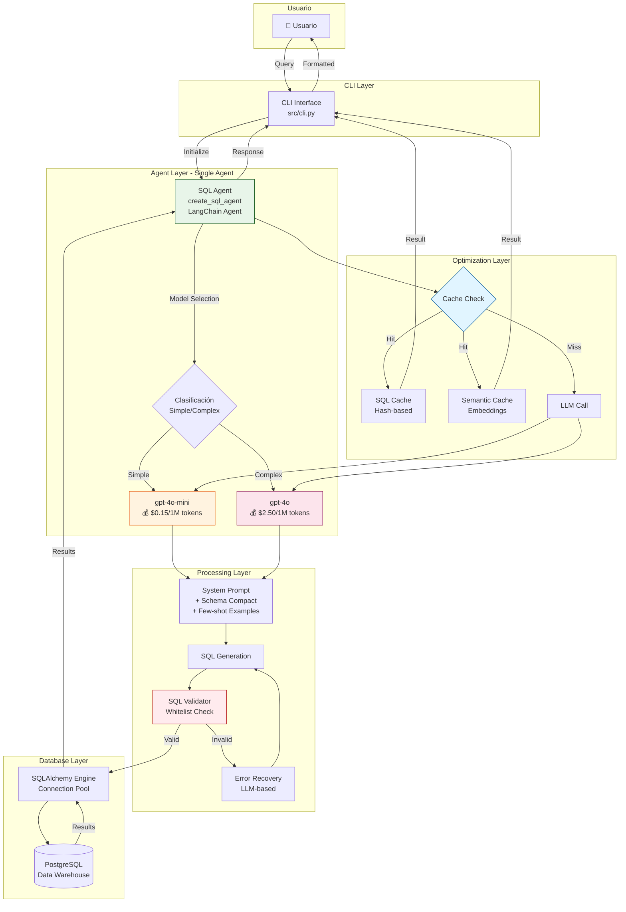
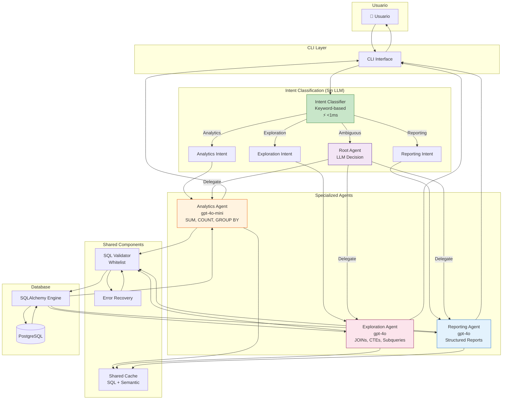
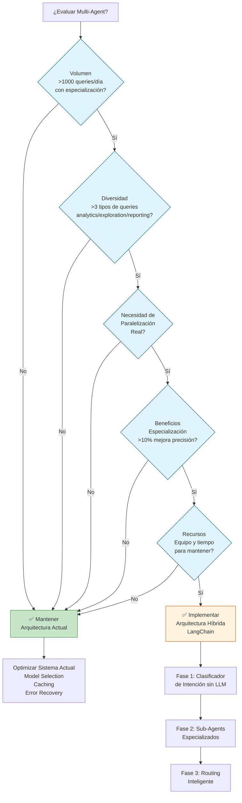
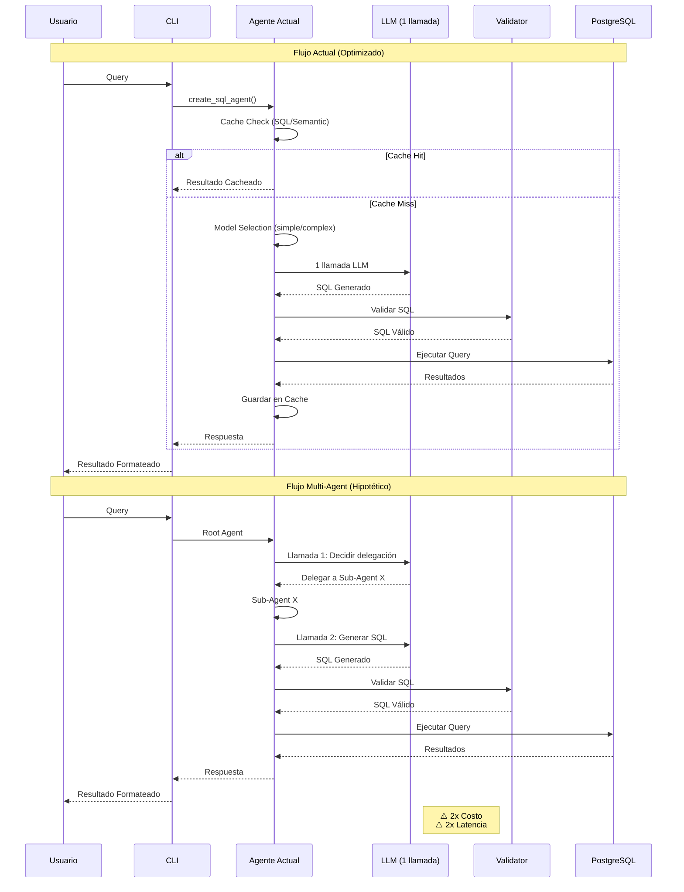
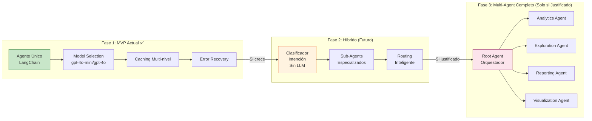

# Análisis Arquitectónico: Integración de Multi-Agent System (Patrón ADK)

## 📋 Resumen Ejecutivo

**Recomendación:** **NO implementar multi-agent system en el estado actual del proyecto**, pero **SÍ documentar la arquitectura evolutiva** para futuras expansiones.

**Razón Principal:** El sistema actual ya implementa optimizaciones equivalentes (model selection, caching, error recovery) que resuelven los problemas que multi-agent abordaría, sin añadir la complejidad adicional.

---

## 🔍 Análisis de la Arquitectura Actual

### Estado Actual del Sistema

El sistema LLM-DW MVP tiene la siguiente arquitectura:

```
Usuario → CLI → SQL Agent (LangChain) → LLM (GPT-4o/gpt-4o-mini) → SQL Validator → PostgreSQL
```

**Componentes Clave:**
- **Agente Único:** `create_sql_agent()` en `src/agents/sql_agent.py`
- **Model Selection Inteligente:** Clasifica queries simples vs complejas y usa `gpt-4o-mini` o `gpt-4o` según corresponda
- **Error Recovery:** Función `recover_from_error()` que usa LLM para corregir SQL fallido
- **Caching Multi-nivel:** SQL cache (hash-based) + Semantic cache (embeddings)
- **Validación Estricta:** `SQLValidator` con whitelist de tablas/columnas
- **Optimizaciones:** Schema compression, few-shot examples, prompt caching

### Fortalezas del Sistema Actual

1. **Simplicidad:** Flujo directo y fácil de entender
2. **Optimización de Costos:** Model selection reduce costos en queries simples
3. **Baja Latencia:** Sin overhead de delegación entre agentes
4. **Mantenibilidad:** Código simple y bien estructurado
5. **Robustez:** Error recovery y validación estricta

### Limitaciones Identificadas

1. **Monolítico:** Un solo agente maneja todos los tipos de queries
2. **Sin Especialización:** Mismo prompt para queries analíticas, exploratorias, reportes
3. **Escalabilidad Limitada:** Agregar nuevos tipos de queries requiere modificar el agente principal
4. **Sin Paralelización:** No puede procesar múltiples queries simultáneamente

---

## 🏗️ Arquitectura Multi-Agent (Patrón ADK)

### Conceptos Clave de ADK Multi-Agent

**1. Root Agent (Orquestador)**
- Recibe la petición inicial del usuario
- Analiza la intención usando LLM
- Decide a qué sub-agente delegar basándose en `description` de cada sub-agent
- Puede manejar tareas directamente si no hay sub-agent apropiado

**2. Sub-Agents (Especializados)**
- Cada uno tiene un propósito específico claramente definido
- Instrucciones (`instruction`) optimizadas para su dominio
- Herramientas (`tools`) específicas para su tarea
- Descripción (`description`) que el root agent usa para delegación

**3. Delegación Automática (Auto-Flow)**
- El root agent usa su LLM para decidir delegación
- Basado en matching semántico entre query del usuario y `description` de sub-agents
- No requiere código explícito de routing

**4. Session State Compartido**
- Todos los agentes comparten el mismo `session.state`
- Permite contexto compartido entre agentes
- Herramientas pueden leer/escribir estado

### Ejemplo de Arquitectura Multi-Agent para SQL

```python
# Root Agent (Orquestador)
root_agent = Agent(
    name="sql_coordinator",
    description="Coordina queries SQL y delega a especialistas",
    instruction="Analiza la query y delega a: analytics_agent (agregaciones), 
                 exploration_agent (exploración de datos), reporting_agent (reportes)",
    sub_agents=[analytics_agent, exploration_agent, reporting_agent]
)

# Sub-Agent: Analytics
analytics_agent = Agent(
    name="analytics_agent",
    description="Genera queries SQL para análisis agregados (SUM, COUNT, GROUP BY)",
    instruction="Especialista en queries analíticas. Genera SQL optimizado para agregaciones...",
    tools=[validated_sql_query],
    model="gpt-4o-mini"  # Modelo más barato para queries simples
)

# Sub-Agent: Exploration
exploration_agent = Agent(
    name="exploration_agent",
    description="Genera queries SQL para exploración de datos (JOINs, CTEs, subqueries)",
    instruction="Especialista en queries complejas. Genera SQL con JOINs, CTEs...",
    tools=[validated_sql_query],
    model="gpt-4o"  # Modelo más potente para complejidad
)
```

---

## ⚖️ Comparación: Sistema Actual vs Multi-Agent

### Tabla Comparativa

| Aspecto | Sistema Actual | Multi-Agent (ADK) |
|---------|---------------|-------------------|
| **Arquitectura** | Agente único monolítico | Root agent + sub-agents especializados |
| **Model Selection** | ✅ Clasificación automática (simple/complex) | ✅ Cada sub-agent puede usar modelo diferente |
| **Latencia** | ⚡ Baja (1 llamada LLM) | ⚠️ Media (2 llamadas: root + sub-agent) |
| **Costo por Query** | 💰 Optimizado (model selection) | ⚠️ Potencialmente mayor (root + sub-agent) |
| **Complejidad** | ✅ Baja | ⚠️ Alta (coordinación, debugging) |
| **Especialización** | ⚠️ Limitada (mismo prompt) | ✅ Alta (prompts específicos por dominio) |
| **Escalabilidad** | ⚠️ Requiere modificar agente principal | ✅ Fácil agregar nuevos sub-agents |
| **Mantenibilidad** | ✅ Simple | ⚠️ Compleja (múltiples agentes, estados) |
| **Paralelización** | ❌ No soportada | ✅ Posible (múltiples sub-agents) |
| **Error Recovery** | ✅ Implementado | ✅ Puede ser por sub-agent |
| **Caching** | ✅ Multi-nivel (SQL + semantic) | ✅ Compartido entre agentes |

### Análisis de Costos

**Sistema Actual:**
- Query simple: 1 llamada a `gpt-4o-mini` (~$0.15/1M tokens input)
- Query compleja: 1 llamada a `gpt-4o` (~$2.50/1M tokens input)

**Multi-Agent:**
- Query simple: 1 llamada root agent (`gpt-4o`) + 1 llamada sub-agent (`gpt-4o-mini`) = **2x costo**
- Query compleja: 1 llamada root agent (`gpt-4o`) + 1 llamada sub-agent (`gpt-4o`) = **2x costo**

**Conclusión:** Multi-agent **duplica el costo** de tokens porque requiere 2 llamadas LLM (root decide + sub-agent ejecuta).

### Análisis de Latencia

**Sistema Actual:**
- Query simple: ~2-5s (1 llamada LLM + ejecución SQL)
- Query compleja: ~5-15s (1 llamada LLM + ejecución SQL)

**Multi-Agent:**
- Query simple: ~4-10s (root agent ~2-3s + sub-agent ~2-5s + ejecución SQL)
- Query compleja: ~10-30s (root agent ~3-5s + sub-agent ~5-15s + ejecución SQL)

**Conclusión:** Multi-agent **aumenta la latencia** significativamente debido al overhead de delegación.

---

## 🎯 Casos de Uso Potenciales para Multi-Agent

### 1. Especialización por Tipo de Query

**Escenario:** Diferentes tipos de queries requieren diferentes enfoques:
- **Analytics Agent:** Queries agregadas (SUM, COUNT, GROUP BY)
- **Exploration Agent:** Queries con JOINs, CTEs, subqueries
- **Reporting Agent:** Queries para generar reportes estructurados
- **Visualization Agent:** Queries optimizadas para visualizaciones

**Evaluación:** 
- ✅ **Beneficio:** Prompts más específicos podrían mejorar precisión
- ❌ **Costo:** Duplica llamadas LLM y latencia
- ❌ **Alternativa Actual:** El sistema ya usa model selection y few-shot examples que logran similar especialización

### 2. Validación SQL como Agente Separado

**Escenario:** Un agente especializado solo en validación SQL antes de ejecutar.

**Evaluación:**
- ❌ **No Recomendado:** La validación actual es síncrona y rápida (~1ms). Convertirla en agente añadiría latencia innecesaria sin beneficios.

### 3. Optimización de Queries

**Escenario:** Un agente que analiza el SQL generado y lo optimiza antes de ejecutar.

**Evaluación:**
- ⚠️ **Potencialmente Útil:** Podría mejorar performance de queries complejas
- ❌ **Costo:** Añade otra llamada LLM
- ✅ **Alternativa:** Implementar como función post-procesamiento, no como agente

### 4. Explicación de Resultados

**Escenario:** Un agente especializado en explicar resultados de queries de forma inteligente.

**Evaluación:**
- ✅ **Útil:** Ya existe `explain_query()`, pero como agente podría ser más contextual
- ⚠️ **Costo:** Requiere llamada LLM adicional solo cuando se solicita explicación
- ✅ **Viable:** Solo si se activa bajo demanda (flag `--explain`)

### 5. Paralelización de Queries

**Escenario:** Múltiples queries simultáneas procesadas por diferentes sub-agents.

**Evaluación:**
- ✅ **Beneficio Real:** Permite procesar múltiples queries en paralelo
- ⚠️ **Complejidad:** Requiere gestión de concurrencia y recursos
- ❌ **Caso de Uso Actual:** El sistema es CLI single-user, no necesita paralelización

---

## 📊 Investigación de Mejores Prácticas

### Hallazgos de Investigación Web

1. **Multi-Agent vs Single-Agent para SQL Generation:**
   - Multi-agent mejora precisión en **tareas complejas** (hasta 40% según estudios)
   - Single-agent es más eficiente para **tareas simples**
   - El sistema actual ya clasifica simple vs complex, optimizando automáticamente

2. **Costos y Latencia:**
   - Multi-agent **duplica costos** (root + sub-agent)
   - Añade **overhead de latencia** (delegación requiere 2 llamadas LLM)
   - Solo justificable si los beneficios superan estos costos

3. **Arquitectura ADK vs LangChain:**
   - ADK: Hierárquico, event-driven, delegación LLM-driven
   - LangChain: Graph-based, message passing, control explícito
   - El sistema actual usa LangChain, migrar a ADK requeriría refactorización significativa

### Benchmarking de Sistemas Similares

**SQLGenie (Multi-Agent):**
- 64% reducción en tiempo de generación SQL
- Pero requiere múltiples agentes especializados y coordinación compleja

**Sistema Actual:**
- Ya optimizado con model selection (gpt-4o-mini para simples)
- Caching reduce latencia en queries repetidas
- Error recovery maneja casos complejos

**Conclusión:** Para el caso de uso actual (MVP SQL generation), el sistema actual es más eficiente.

---

## ✅ Recomendación Final

### Para el Estado Actual (MVP)

**NO implementar multi-agent** por las siguientes razones:

1. **Over-Engineering:** El sistema actual resuelve eficientemente el problema sin necesidad de multi-agent
2. **Costos Duplicados:** Multi-agent duplicaría costos de tokens sin beneficios claros
3. **Latencia Aumentada:** Añadiría overhead de delegación innecesario
4. **Complejidad Añadida:** Haría el código más difícil de mantener y debuggear
5. **Ya Optimizado:** Model selection, caching, y error recovery ya optimizan el sistema

### Para Evolución Futura

**SÍ documentar arquitectura evolutiva** que permita migrar a multi-agent cuando:

1. **El sistema crezca** para soportar múltiples tipos de consultas (analíticas, exploratorias, reportes, visualizaciones)
2. **Se requiera paralelización** de múltiples queries simultáneas
3. **Se necesite especialización profunda** en diferentes dominios (ej: queries financieras vs operacionales)
4. **El volumen de queries** justifique la inversión en arquitectura más compleja

### Arquitectura Evolutiva Propuesta (Futuro)

Si en el futuro se decide implementar multi-agent, la arquitectura recomendada sería:

```
Root Agent (Coordinator)
├── Analytics Agent (queries agregadas, gpt-4o-mini)
├── Exploration Agent (JOINs, CTEs, gpt-4o)
├── Reporting Agent (reportes estructurados, gpt-4o)
└── Visualization Agent (queries para charts, gpt-4o-mini)
```

**Patrón de Implementación:**
- Usar **LangChain AgentExecutor** con routing basado en clasificación de intención
- **NO adoptar ADK completo** (añadiría dependencias innecesarias)
- Implementar patrón similar a ADK pero con LangChain (compatibilidad con código actual)
- Mantener session state compartido para contexto entre agentes

---

## 🔄 Alternativa: Híbrido (Recomendado para Futuro)

### Arquitectura Híbrida con LangChain

En lugar de adoptar ADK completo, implementar un patrón similar usando LangChain:

```python
# Clasificador de Intención (sin LLM, basado en keywords)
def classify_query_intent(question: str) -> str:
    """Clasifica el tipo de query sin usar LLM"""
    # Analytics: SUM, COUNT, total, promedio
    # Exploration: JOIN, subquery, CTE
    # Reporting: reporte, resumen, dashboard
    # Visualization: gráfico, chart, visualizar
    ...

# Root Agent (solo para casos ambiguos)
root_agent = create_agent(...)  # Usa LLM solo si clasificación falla

# Sub-Agents Especializados
analytics_agent = create_sql_agent(..., model="gpt-4o-mini")
exploration_agent = create_sql_agent(..., model="gpt-4o")
reporting_agent = create_sql_agent(..., model="gpt-4o")
```

**Ventajas:**
- ✅ Mantiene compatibilidad con código actual
- ✅ Evita overhead de delegación LLM-driven (usa clasificación rápida)
- ✅ Permite especialización sin duplicar costos
- ✅ Fácil de implementar incrementalmente

**Cuándo Implementar:**
- Cuando se agreguen nuevos tipos de queries (reportes, visualizaciones)
- Cuando el volumen de queries justifique especialización
- Cuando se requiera paralelización

---

## 📝 Plan de Acción Recomendado

### Fase 1: Estado Actual (MVP) - ✅ Completado
- Mantener arquitectura actual (agente único)
- Optimizar con model selection, caching, error recovery
- **NO implementar multi-agent**

### Fase 2: Evolución Incremental (Futuro)
Si el sistema crece, implementar híbrido:

1. **Agregar Clasificador de Intención** (sin LLM)
   - Analytics vs Exploration vs Reporting
   - Basado en keywords y patrones

2. **Crear Sub-Agents Especializados** (solo si necesario)
   - Analytics Agent: para queries agregadas
   - Exploration Agent: para queries complejas
   - Mantener agente único si no hay necesidad real

3. **Implementar Routing Inteligente**
   - Clasificación rápida → routing directo a sub-agent
   - Evitar delegación LLM-driven para reducir latencia

### Fase 3: Multi-Agent Completo (Solo si Justificado)
Solo si:
- El sistema soporta múltiples dominios (finanzas, operaciones, marketing)
- Se requiere paralelización real
- El volumen justifica la complejidad

---

## 🎓 Lecciones Aprendidas de ADK

Aunque **NO recomendamos adoptar ADK completo**, los siguientes patrones de ADK son valiosos:

1. **Delegación Basada en Descripciones:** Usar `description` clara para routing
2. **Session State Compartido:** Contexto compartido entre componentes
3. **Especialización de Prompts:** Instrucciones específicas por dominio
4. **Model Selection por Agente:** Diferentes modelos según complejidad

Estos patrones pueden implementarse con LangChain sin necesidad de ADK.

---

## 📈 Métricas de Éxito para Decisión Futura

Implementar multi-agent solo si se cumplen **TODOS** estos criterios:

1. ✅ **Volumen:** >1000 queries/día que requieran diferentes especializaciones
2. ✅ **Diversidad:** >3 tipos distintos de queries (analytics, exploration, reporting, etc.)
3. ✅ **Paralelización:** Necesidad real de procesar múltiples queries simultáneamente
4. ✅ **Especialización:** Beneficios medibles de prompts especializados (>10% mejora en precisión)
5. ✅ **Recursos:** Equipo y tiempo para mantener arquitectura más compleja

**Si NO se cumplen estos criterios:** Mantener arquitectura actual.

---

## 🔗 Referencias y Recursos

- [ADK Multi-Agent Tutorial](https://google.github.io/adk-docs/tutorials/agent-team/)
- [ADK Agents Documentation](https://google.github.io/adk-docs/agents/#agents-working-together-multi-agent-systems)
- [LangChain Multi-Agent Patterns](https://python.langchain.com/docs/use_cases/more/agents/multi_agent/)
- [Best Practices: Single vs Multi-Agent SQL Generation](https://learn.microsoft.com/en-us/dynamics365/guidance/resources/contact-center-multi-agent-architecture-design)

---

## ✅ Conclusión

**Para el estado actual del proyecto (MVP optimizado):**

- ❌ **NO implementar multi-agent** (over-engineering, costos duplicados, latencia aumentada)
- ✅ **Mantener arquitectura actual** (ya optimizada, simple, eficiente)
- ✅ **Documentar arquitectura evolutiva** para futuras expansiones
- ✅ **Considerar híbrido con LangChain** si el sistema crece significativamente

**El sistema actual es la solución correcta para el problema actual.**

---

## 📊 Diagramas de Arquitectura

### Diagrama 1: Arquitectura Actual (MVP Optimizado)



### Diagrama 2: Arquitectura Híbrida Propuesta (Futuro)



### Diagrama 3: Flujo de Decisión: ¿Cuándo Implementar Multi-Agent?



### Diagrama 4: Comparación de Flujos: Actual vs Multi-Agent



### Diagrama 5: Arquitectura Evolutiva - Roadmap




