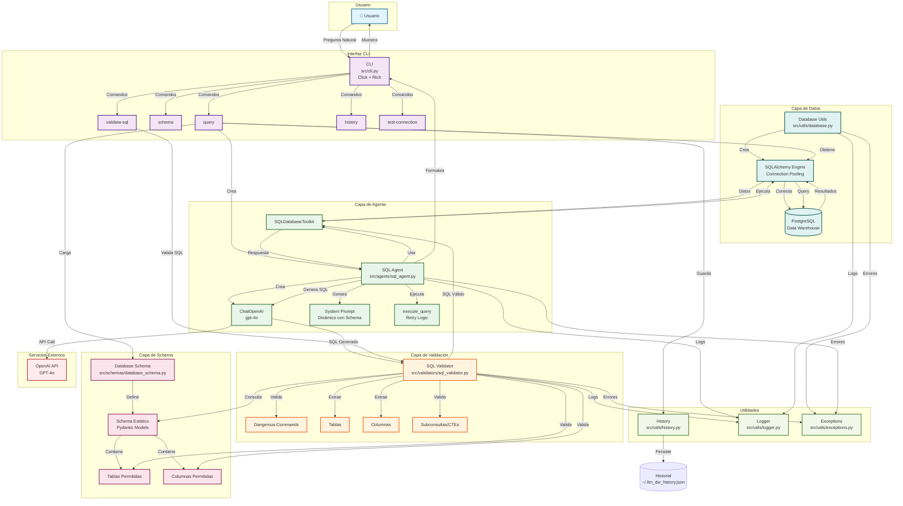
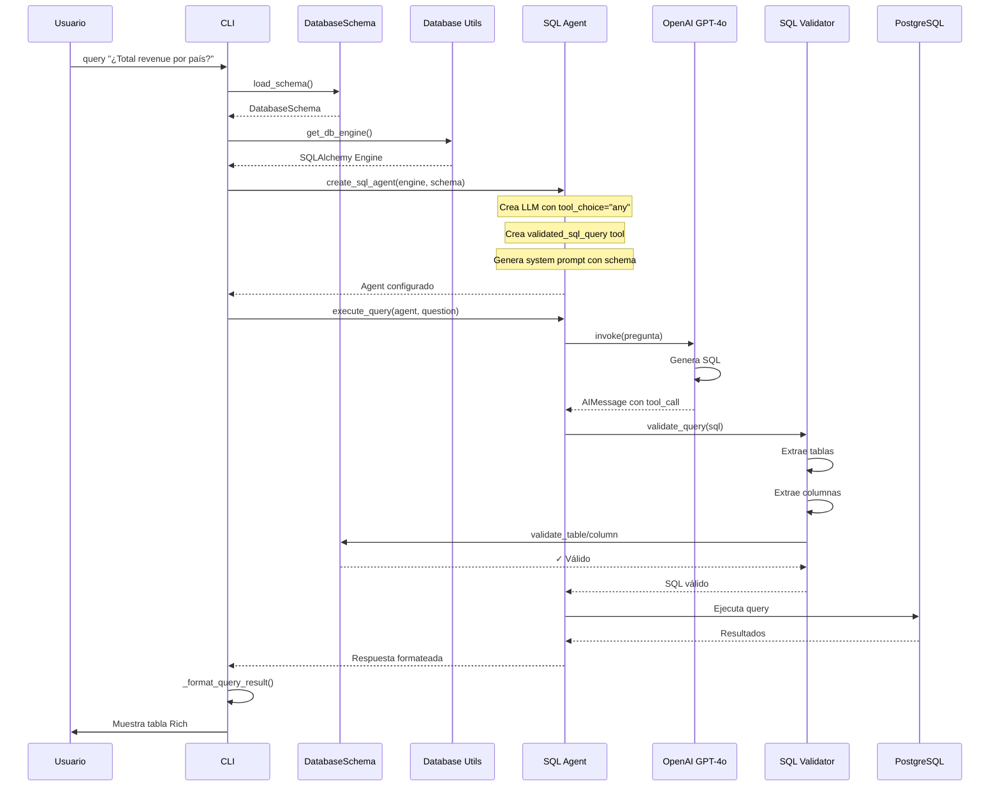
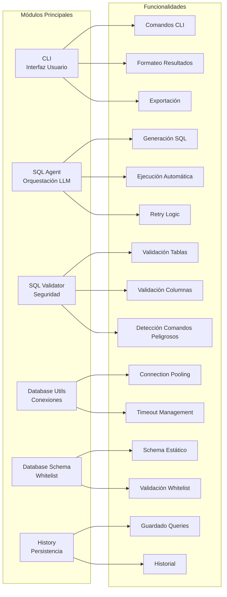
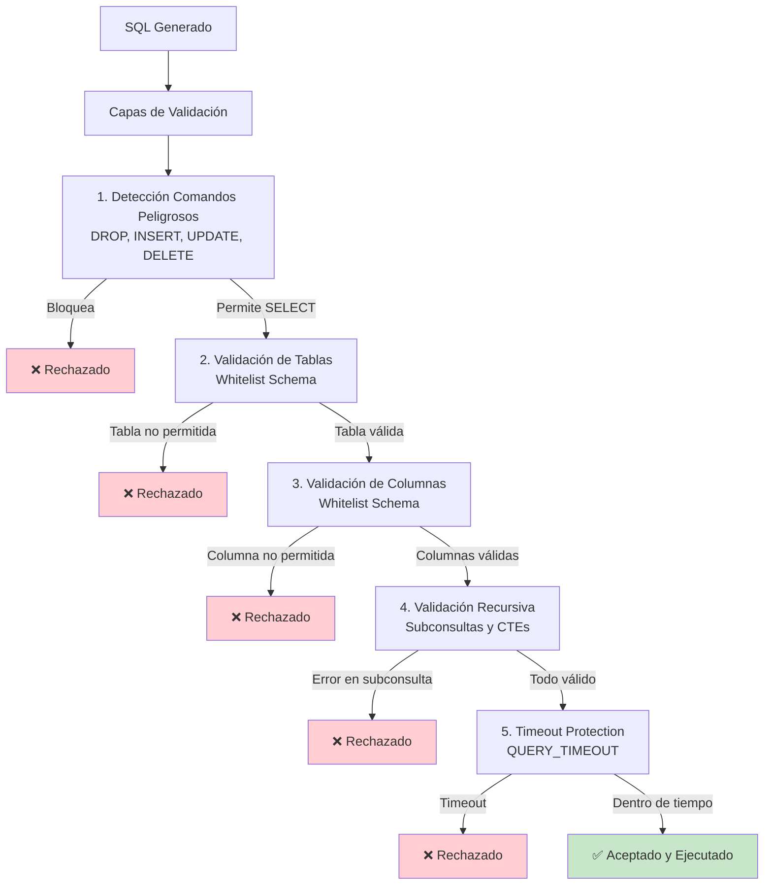
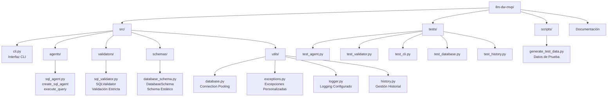
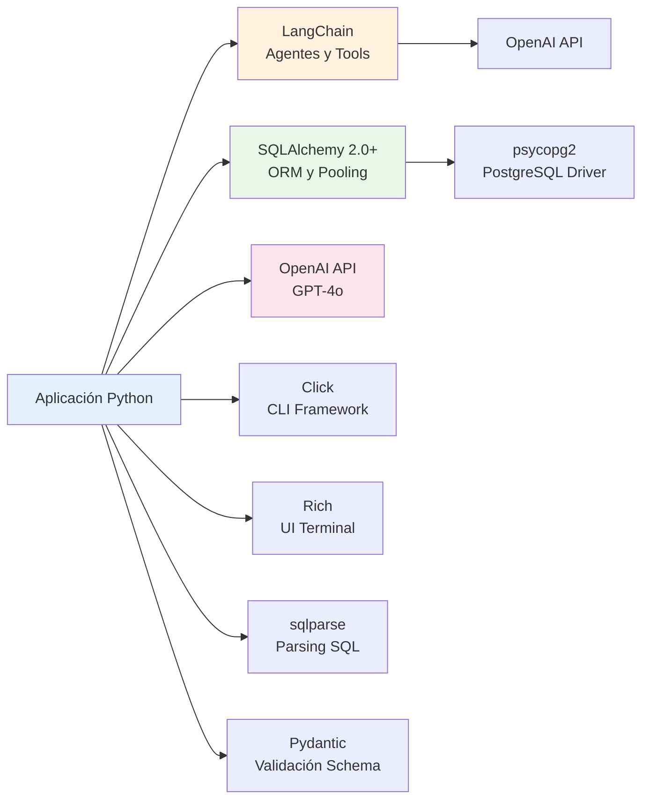

# Arquitectura del Sistema LLM-DW MVP

## Diagrama de Arquitectura

## Flujo de Ejecución Detallado

## Componentes y Responsabilidades

## Capas de Seguridad

## Estructura de Archivos

## Tecnologías y Dependencias

