# Arquitectura del Sistema LLM-DW MVP

## Diagrama de Arquitectura

## Flujo de Ejecución Detallado

```mermaid
sequenceDiagram
    participant U as Usuario
    participant CLI as CLI
    participant Schema as DatabaseSchema
    participant DB as Database Utils
    participant Agent as SQL Agent
    participant LLM as OpenAI GPT-4o
    participant Validator as SQL Validator
    participant PG as PostgreSQL

    U->>CLI: query "¿Total revenue por país?"
    CLI->>Schema: load_schema()
    Schema-->>CLI: DatabaseSchema
    CLI->>DB: get_db_engine()
    DB-->>CLI: SQLAlchemy Engine
    CLI->>Agent: create_sql_agent(engine, schema)
    
    Note over Agent: Crea LLM con tool_choice="any"
    Note over Agent: Crea validated_sql_query tool
    Note over Agent: Genera system prompt con schema
    
    Agent-->>CLI: Agent configurado
    CLI->>Agent: execute_query(agent, question)
    
    Agent->>LLM: invoke(pregunta)
    LLM->>LLM: Genera SQL
    LLM-->>Agent: AIMessage con tool_call
    
    Agent->>Validator: validate_query(sql)
    Validator->>Validator: Extrae tablas
    Validator->>Validator: Extrae columnas
    Validator->>Schema: validate_table/column
    Schema-->>Validator: ✓ Válido
    
    Validator-->>Agent: SQL válido
    Agent->>PG: Ejecuta query
    PG-->>Agent: Resultados
    Agent-->>CLI: Respuesta formateada
    CLI->>CLI: _format_query_result()
    CLI->>U: Muestra tabla Rich
```

## Componentes y Responsabilidades

```mermaid
graph LR
    subgraph "Módulos Principales"
        A[CLI<br/>Interfaz Usuario]
        B[SQL Agent<br/>Orquestación LLM]
        C[SQL Validator<br/>Seguridad]
        D[Database Utils<br/>Conexiones]
        E[Database Schema<br/>Whitelist]
        F[History<br/>Persistencia]
    end
    
    subgraph "Funcionalidades"
        A1[Comandos CLI]
        A2[Formateo Resultados]
        A3[Exportación]
        
        B1[Generación SQL]
        B2[Ejecución Automática]
        B3[Retry Logic]
        
        C1[Validación Tablas]
        C2[Validación Columnas]
        C3[Detección Comandos Peligrosos]
        
        D1[Connection Pooling]
        D2[Timeout Management]
        
        E1[Schema Estático]
        E2[Validación Whitelist]
        
        F1[Guardado Queries]
        F2[Historial]
    end
    
    A --> A1
    A --> A2
    A --> A3
    B --> B1
    B --> B2
    B --> B3
    C --> C1
    C --> C2
    C --> C3
    D --> D1
    D --> D2
    E --> E1
    E --> E2
    F --> F1
    F --> F2
```

## Capas de Seguridad

```mermaid
graph TD
    SQL[SQL Generado] --> L1[Capas de Validación]
    
    L1 --> L2[1. Detección Comandos Peligrosos<br/>DROP, INSERT, UPDATE, DELETE]
    L2 -->|Bloquea| REJECT1[❌ Rechazado]
    L2 -->|Permite SELECT| L3
    
    L3[2. Validación de Tablas<br/>Whitelist Schema]
    L3 -->|Tabla no permitida| REJECT2[❌ Rechazado]
    L3 -->|Tabla válida| L4
    
    L4[3. Validación de Columnas<br/>Whitelist Schema]
    L4 -->|Columna no permitida| REJECT3[❌ Rechazado]
    L4 -->|Columnas válidas| L5
    
    L5[4. Validación Recursiva<br/>Subconsultas y CTEs]
    L5 -->|Error en subconsulta| REJECT4[❌ Rechazado]
    L5 -->|Todo válido| L6
    
    L6[5. Timeout Protection<br/>QUERY_TIMEOUT]
    L6 -->|Timeout| REJECT5[❌ Rechazado]
    L6 -->|Dentro de tiempo| ACCEPT[✅ Aceptado y Ejecutado]
    
    style REJECT1 fill:#ffcdd2
    style REJECT2 fill:#ffcdd2
    style REJECT3 fill:#ffcdd2
    style REJECT4 fill:#ffcdd2
    style REJECT5 fill:#ffcdd2
    style ACCEPT fill:#c8e6c9
```

## Estructura de Archivos

```mermaid
graph TD
    ROOT[llm-dw-mvp/] --> SRC[src/]
    ROOT --> TESTS[tests/]
    ROOT --> SCRIPTS[scripts/]
    ROOT --> DOCS[Documentación]
    
    SRC --> CLI[cli.py<br/>Interfaz CLI]
    SRC --> AGENTS[agents/]
    SRC --> VALIDATORS[validators/]
    SRC --> SCHEMAS[schemas/]
    SRC --> UTILS[utils/]
    
    AGENTS --> AGENT_FILE[sql_agent.py<br/>create_sql_agent<br/>execute_query]
    
    VALIDATORS --> VALIDATOR_FILE[sql_validator.py<br/>SQLValidator<br/>Validación Estricta]
    
    SCHEMAS --> SCHEMA_FILE[database_schema.py<br/>DatabaseSchema<br/>Schema Estático]
    
    UTILS --> DB_UTIL[database.py<br/>Connection Pooling]
    UTILS --> EXCEPTIONS_UTIL[exceptions.py<br/>Excepciones Personalizadas]
    UTILS --> LOGGER_UTIL[logger.py<br/>Logging Configurado]
    UTILS --> HISTORY_UTIL[history.py<br/>Gestión Historial]
    
    TESTS --> TEST_AGENT[test_agent.py]
    TESTS --> TEST_VALIDATOR[test_validator.py]
    TESTS --> TEST_CLI[test_cli.py]
    TESTS --> TEST_DB[test_database.py]
    TESTS --> TEST_HISTORY[test_history.py]
    
    SCRIPTS --> GEN_DATA[generate_test_data.py<br/>Datos de Prueba]
```

## Tecnologías y Dependencias

```mermaid
graph LR
    APP[Aplicación Python] --> LANGCHAIN[LangChain<br/>Agentes y Tools]
    APP --> SQLALCHEMY[SQLAlchemy 2.0+<br/>ORM y Pooling]
    APP --> OPENAI_PY[OpenAI API<br/>GPT-4o]
    APP --> CLICK[Click<br/>CLI Framework]
    APP --> RICH[Rich<br/>UI Terminal]
    APP --> SQLPARSE[sqlparse<br/>Parsing SQL]
    APP --> PYDANTIC[Pydantic<br/>Validación Schema]
    
    LANGCHAIN --> OPENAI_API[OpenAI API]
    SQLALCHEMY --> POSTGRES_DRIVER[psycopg2<br/>PostgreSQL Driver]
    
    style APP fill:#e3f2fd
    style LANGCHAIN fill:#fff3e0
    style SQLALCHEMY fill:#e8f5e9
    style OPENAI_PY fill:#fce4ec
```

