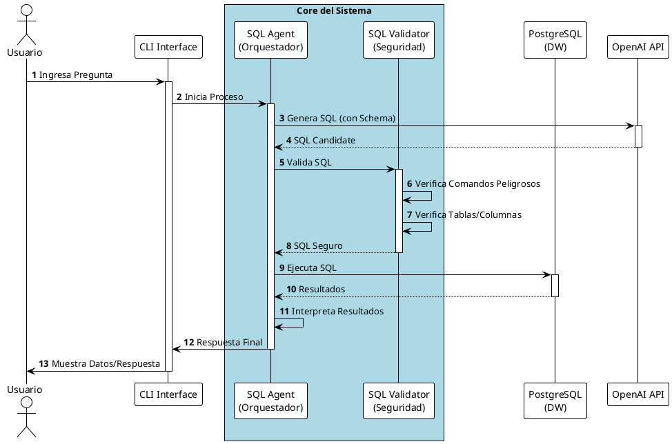
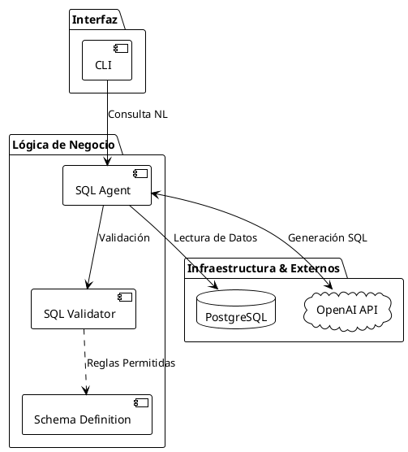

# Arquitectura End-to-End Resumida (PlantUML)

Este documento presenta una vista resumida de la arquitectura y el flujo del sistema utilizando PlantUML.

## Diagrama de Flujo (Sequence Diagram)

## Diagrama de Componentes (High Level)

