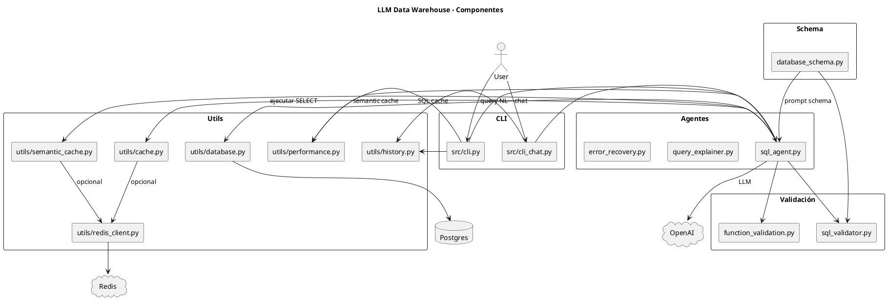
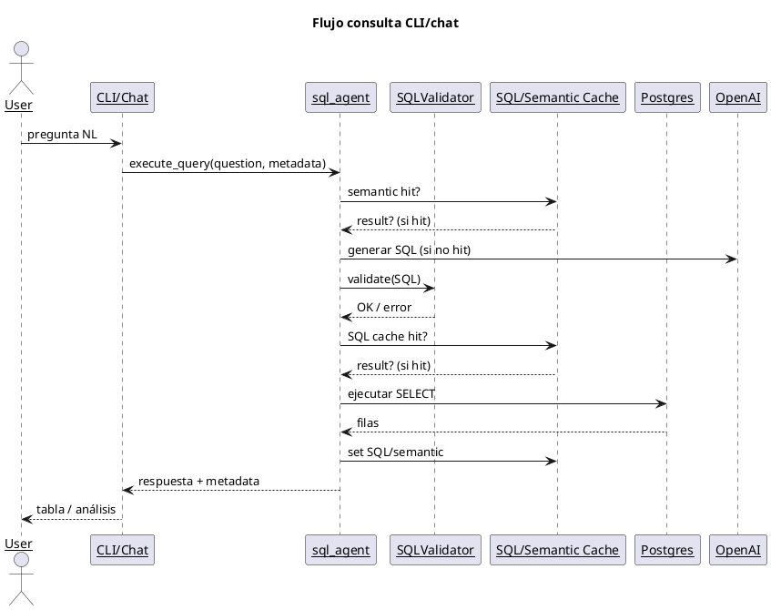
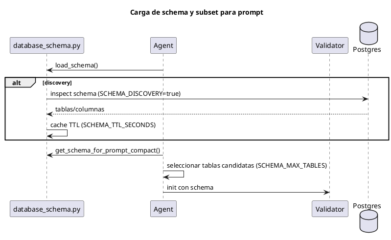
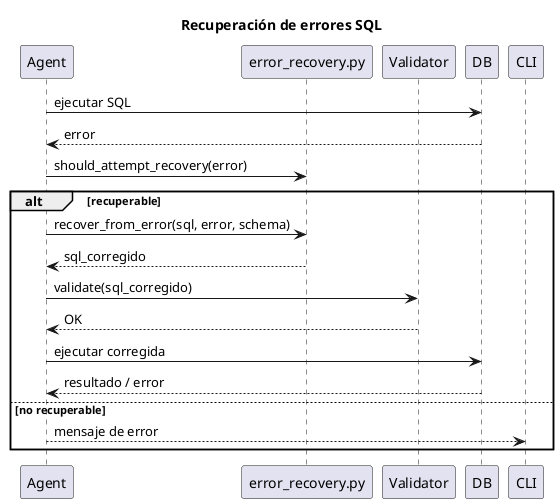
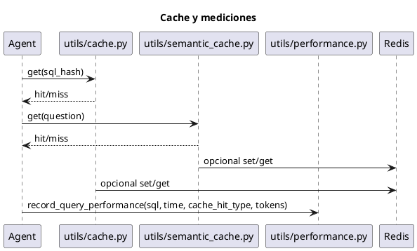

# Arquitectura (PlantUML)

## Diagrama de componentes (vista general)

## Flujo de consulta (secuencia)

## Descubrimiento y schema compacto

## Manejo de errores y recuperación

## Caché y rendimiento

